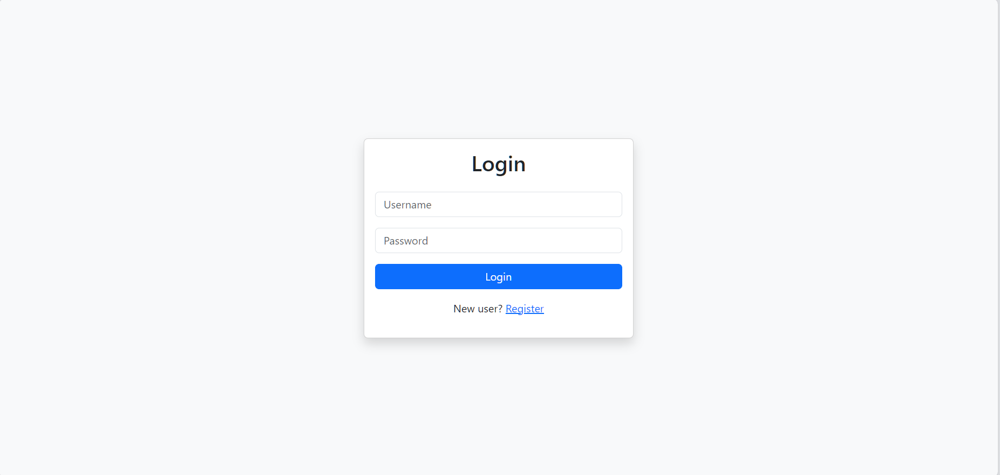
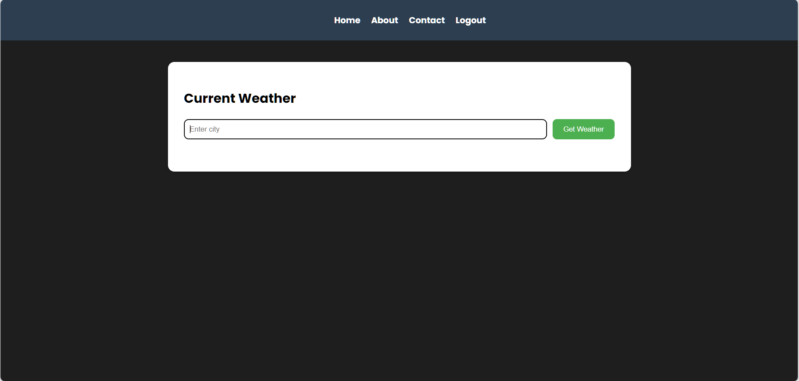
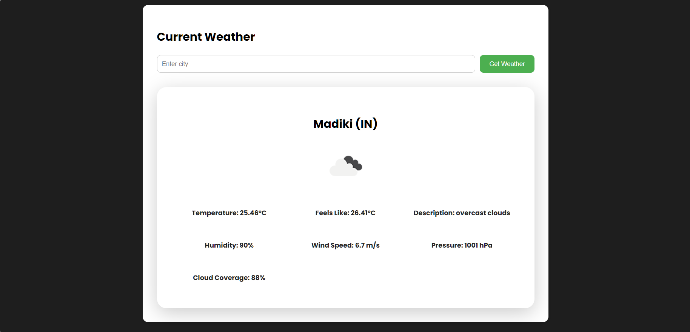

# 🌦️ Weather Forecast App

A web-based Weather Forecast App built with **Flask**, **MongoDB**, and the **OpenWeatherMap API**. Users can register, log in, and search real-time weather information for cities around the world.

---

## 🚀 Features

- 🔐 User authentication (Register/Login/Logout)
- 📍 Search weather by city name
- 🌡️ View temperature, humidity, wind speed, cloudiness, pressure
- 💡 Responsive UI
- ⚙️ Built with Flask, MongoDB, and OpenWeatherMap API

---

## 🔧 Tech Stack

- **Backend:** Python (Flask)
- **Frontend:** HTML, CSS 
- **Database:** MongoDB (via PyMongo)
- **API:** OpenWeatherMap
- **User Auth:** Flask-Login

---

## 🛠️ Setup Instructions

### 1. Clone the Repository
```bash
[git clone https://github.com/your-username/weather_app.git](https://github.com/pavan2k317/weather_forecast.git)
cd weather_app
```

### 2. Create and Activate a Virtual Environment
```bash
# For Linux/macOS:
python -m venv venv
source venv/bin/activate

# For Windows:
python -m venv venv
venv\Scripts\activate
```

### 3. Install Dependencies
```bash
pip install -r requirements.txt
```

### 4. Add `.env` File
Create a `.env` file in the root directory with the following:

```
SECRET_KEY=your-secret-key
MONGO_URI=your-mongodb-uri
WEATHER_API_KEY=your-openweathermap-api-key
```

### 5. Run the Application
```bash
python app.py
```

Then open your browser at [http://localhost:5000](http://localhost:5000)

---

## 📸 Screenshots

### 🔐 Login Page


### 🏠 Home Page (Search Weather)


### 🌦️ Weather Result



---

## 📝 License

This project is licensed under the **MIT License**.  
Feel free to use, modify, and distribute it for personal or commercial purposes.
